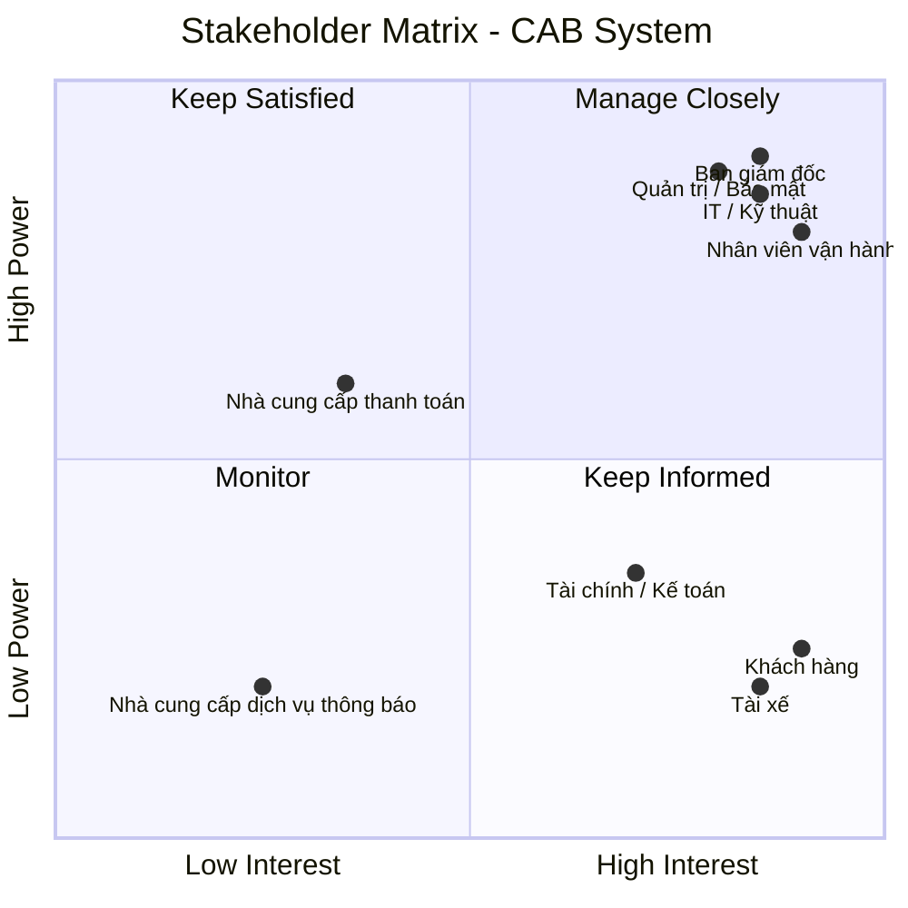
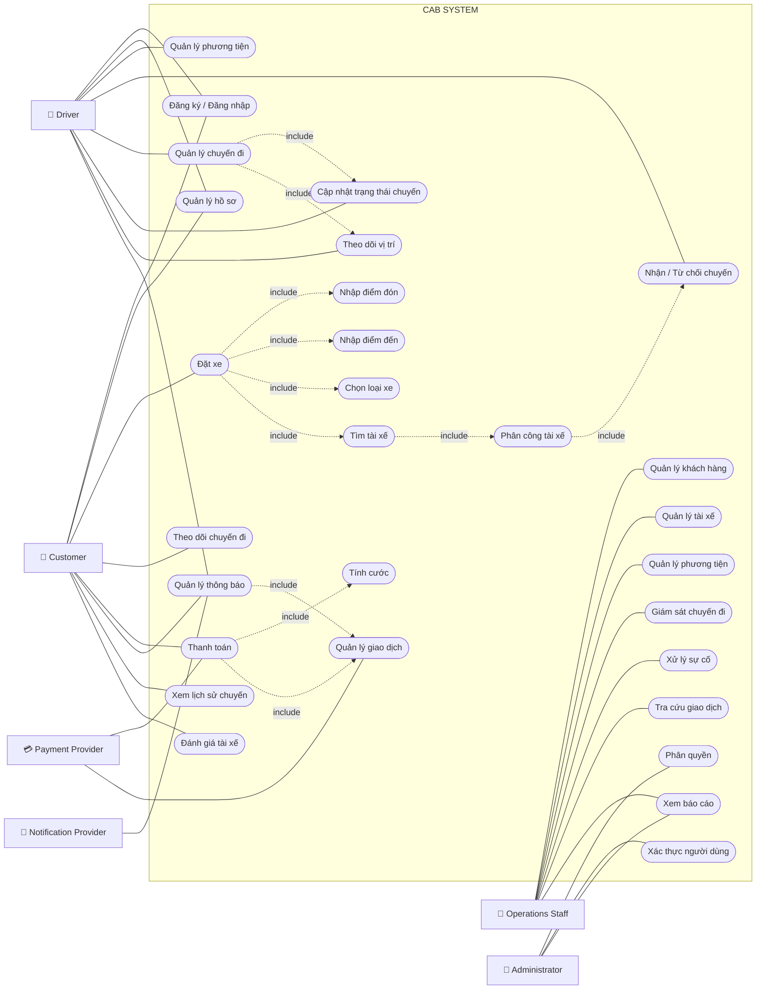

# 23655901_lehoangyen_cabsystem

# 1. Vấn đề danh nghiệp
- Đặt xe còn phụ thuộc nhiều vào tổng đài và thao tác thủ công.
- Việc tìm và phân công tài xế chưa tự động, khó mở rộng khi số lượng chuyến tăng.
- Khách hàng khó theo dõi trạng thái chuyến đi theo thời gian thực.
- Thông tin cước phí và thanh toán chưa được quản lý tập trung.
- Việc gửi thông báo chưa có kiến trúc linh hoạt để mở rộng nhiều kênh.
- Nhân viên vận hành thiếu công cụ để theo dõi, xử lý và quản lý chuyến.
- Khó kiểm soát quyền truy cập, bảo mật và lịch sử thao tác.
- Hệ thống chưa có khả năng mở rộng tốt khi nhu cầu tăng cao.
- Nhiều chính sách nghiệp vụ quan trọng vẫn chưa được xác định rõ.
# 2. Xác định stakeholder
| STT | Stakeholder | Vai trò  |
| --- | --- | --- |
| 1 | **Ban giám đốc** | Định hướng dự án, phê duyệt ngân sách, theo dõi hiệu quả kinh doanh và báo cáo tổng thể. |
| 2 | **Khách hàng** | Đăng ký, đặt xe, theo dõi chuyến, thanh toán, xem lịch sử và đánh giá tài xế. |
| 3 | **Tài xế** | Quản lý hồ sơ, phương tiện, trạng thái hoạt động; nhận và thực hiện chuyến; cập nhật trạng thái và vị trí. |
| 4 | **Nhân viên vận hành** | Quản lý khách hàng, tài xế, phương tiện, chuyến đi; giám sát và xử lý các trường hợp bất thường. |
| 5 | **Bộ phận IT / Kỹ thuật** | Phát triển, triển khai, vận hành, bảo trì, đảm bảo hiệu năng, khả năng mở rộng và tích hợp hệ thống. |
| 6 | **Bộ phận Tài chính / Kế toán** | Theo dõi doanh thu, giao dịch, đối soát thanh toán và hỗ trợ báo cáo tài chính. |
| 7 | **Bộ phận Quản trị / Bảo mật** | Quản lý quyền truy cập, bảo vệ dữ liệu, kiểm tra nhật ký thao tác và xử lý các vấn đề bảo mật. |
| 8 | **Nhà cung cấp thanh toán** | Xử lý các giao dịch thanh toán điện tử và trả kết quả giao dịch cho hệ thống CAB. |
| 9 | **Nhà cung cấp dịch vụ thông báo** | Cung cấp SMS, email, push notification và hỗ trợ mở rộng thêm các kênh thông báo. |

# Stakeholder Matrix

Ma trận Stakeholder được phân loại dựa trên hai tiêu chí:
- **Power:** Mức độ quyền lực/ảnh hưởng đến dự án.
- **Interest:** Mức độ quan tâm đến dự án.

 # 3. Mục đích nghiệp vụ của các bên liên quan
## Mục đích của các Stakeholder
| STT | Stakeholder | Mục đích / Mối quan tâm |
| --- | --- | --- |
| 1 | **Ban giám đốc** | Nâng cao hiệu quả kinh doanh, kiểm soát hoạt động và có dữ liệu, báo cáo để hỗ trợ ra quyết định. |
| 2 | **Khách hàng** | Đặt xe thuận tiện, biết trạng thái chuyến, thông tin tài xế, thời gian dự kiến đến; thanh toán và đánh giá dịch vụ dễ dàng. |
| 3 | **Tài xế** | Nhận các chuyến phù hợp, quản lý trạng thái hoạt động, cập nhật vị trí và thực hiện chuyến thuận tiện. |
| 4 | **Nhân viên vận hành** | Quản lý, giám sát khách hàng, tài xế, phương tiện và chuyến đi; nhanh chóng phát hiện và xử lý các trường hợp bất thường. |
| 5 | **Bộ phận IT / Kỹ thuật** | Đảm bảo hệ thống hoạt động ổn định, bảo mật, có khả năng mở rộng và dễ dàng tích hợp hoặc thay đổi các thành phần kỹ thuật. |
| 6 | **Bộ phận Tài chính / Kế toán** | Theo dõi doanh thu, giao dịch, đối soát thanh toán và cung cấp dữ liệu phục vụ báo cáo tài chính. |
| 7 | **Bộ phận Quản trị / Bảo mật** | Kiểm soát quyền truy cập, bảo vệ dữ liệu và theo dõi các thao tác quan trọng để phục vụ kiểm tra, xử lý sự cố. |
| 8 | **Nhà cung cấp thanh toán** | Cung cấp dịch vụ thanh toán điện tử an toàn, ổn định và xử lý các giao dịch từ hệ thống CAB. |
| 9 | **Nhà cung cấp dịch vụ thông báo** | Cung cấp các kênh thông báo như SMS, email, push notification và hỗ trợ mở rộng thêm các kênh trong tương lai. |

## Business Goals – Mục tiêu nghiệp vụ

| ID | Business Goal | Ý nghĩa |
| --- | --- | --- |
| **BG01** | **Tự động hóa quy trình đặt và phân công xe** | Giảm sự phụ thuộc vào tổng đài và việc phân công tài xế thủ công. |
| **BG02** | **Nâng cao trải nghiệm khách hàng** | Giúp khách hàng dễ dàng đặt xe, theo dõi trạng thái chuyến, tài xế và thời gian dự kiến đến. |
| **BG03** | **Tối ưu hóa việc phân công tài xế** | Tự động tìm và ưu tiên tài xế phù hợp, gần khách hàng và đang sẵn sàng nhận chuyến. |
| **BG04** | **Quản lý tập trung hoạt động vận hành** | Cung cấp nền tảng quản lý khách hàng, tài xế, phương tiện và chuyến đi cho nhân viên vận hành. |
| **BG05** | **Nâng cao hiệu quả quản lý doanh thu và thanh toán** | Chuẩn hóa việc tính cước, quản lý giao dịch và hỗ trợ thanh toán tiền mặt, điện tử. |
| **BG06** | **Nâng cao khả năng giám sát và ra quyết định** | Cung cấp dữ liệu và báo cáo về số chuyến, doanh thu, tỷ lệ hoàn thành, hủy chuyến và hiệu quả tài xế. |
| **BG07** | **Đảm bảo khả năng mở rộng của hệ thống** | Cho phép hệ thống phục vụ số lượng lớn khách hàng, tài xế và mở rộng các thành phần khi tải tăng. |
| **BG08** | **Tăng tính linh hoạt trong phát triển sản phẩm** | Cho phép bổ sung dịch vụ, phương thức thanh toán, kênh thông báo hoặc thay đổi thành phần kỹ thuật. |
| **BG09** | **Đảm bảo bảo mật và kiểm soát truy cập** | Bảo vệ thông tin cá nhân, phương tiện, vị trí, giao dịch và kiểm soát các thao tác quản trị. |
| **BG10** | **Nâng cao độ tin cậy và tính sẵn sàng** | Hạn chế ảnh hưởng dây chuyền khi một thành phần như thanh toán hoặc thông báo gặp lỗi. |
# 4. Phạm vi cơ bản của hệ thống
| STT | Module | Phạm vi cốt lõi |
|:---:|---|---|
| 1 | **Quản lý tài khoản & hồ sơ** | Đăng ký, đăng nhập, cập nhật thông tin khách hàng/tài xế; quản lý hồ sơ và phương tiện của tài xế. |
| 2 | **Đặt xe** | Khách hàng nhập điểm đón, điểm đến, chọn loại xe. |
| 3 | **Tìm tài xế** | Hệ thống tìm và phân công tài xế phù hợp dựa trên vị trí, trạng thái và tiêu chí vận hành. |
| 4 | **Quản lý chuyến đi & vị trí** | Tài xế nhận chuyến, cập nhật trạng thái từ đến điểm đón, đón khách, đang di chuyển đến hoàn thành; cập nhật vị trí để hỗ trợ theo dõi và dự kiến thời gian đến. |
| 5 | **Tính cước & thanh toán** | Tính số tiền phải trả sau chuyến; hỗ trợ thanh toán tiền mặt và thanh toán điện tử thông qua Payment Provider; xử lý kết quả giao dịch. |
| 6 | **Thông báo** | Gửi thông báo cho khách hàng và tài xế về yêu cầu đặt xe, nhận chuyến, trạng thái chuyến, hoàn thành chuyến và kết quả thanh toán. |
| 7 | **Đánh giá & lịch sử chuyến** | Khách hàng xem lịch sử chuyến, số tiền phải trả và đánh giá tài xế sau khi hoàn thành chuyến. |
| 8 | **Quản lý vận hành** | Nhân viên vận hành quản lý khách hàng, tài xế, phương tiện, chuyến đi; theo dõi chuyến đang diễn ra và xử lý các trường hợp phát sinh. |
| 9 | **Quản lý giao dịch & báo cáo** | Tra cứu lịch sử giao dịch và cung cấp báo cáo cơ bản về số chuyến, doanh thu, tỷ lệ hoàn thành, tỷ lệ hủy và hiệu quả tài xế. |
| 10 | **Bảo mật & phân quyền** | Xác thực người dùng, phân quyền nhân viên/quản trị viên, bảo vệ dữ liệu cá nhân, vị trí và giao dịch; lưu vết các thao tác quan trọng. |
# 5. Yêu cầu danh nghiệp
## Business Requirements

| ID | Module | Business Requirement |
| --- | --- | --- |
| **BR-01** | **Quản lý tài khoản & hồ sơ** | Hệ thống phải hỗ trợ quản lý tài khoản, hồ sơ khách hàng, tài xế và thông tin phương tiện. |
| **BR-02** | **Đặt xe** | Hệ thống phải hỗ trợ khách hàng tạo yêu cầu đặt xe dựa trên điểm đón, điểm đến và loại xe. |
| **BR-03** | **Tìm tài xế** | Hệ thống phải tự động tìm kiếm và phân công tài xế phù hợp dựa trên vị trí, trạng thái và các tiêu chí vận hành. |
| **BR-04** | **Quản lý chuyến đi & vị trí** | Hệ thống phải hỗ trợ quản lý chuyến đi, cập nhật trạng thái và vị trí tài xế trong quá trình thực hiện chuyến. |
| **BR-05** | **Tính cước & thanh toán** | Hệ thống phải hỗ trợ tính cước và thanh toán bằng tiền mặt hoặc thanh toán điện tử thông qua nhà cung cấp thanh toán bên ngoài. |
| **BR-06** | **Thông báo** | Hệ thống phải cung cấp cơ chế thông báo cho khách hàng và tài xế về các sự kiện quan trọng trong quá trình đặt và thực hiện chuyến. |
| **BR-07** | **Đánh giá & lịch sử chuyến** | Hệ thống phải hỗ trợ khách hàng tra cứu lịch sử chuyến, số tiền đã thanh toán và đánh giá tài xế sau khi hoàn thành chuyến. |
| **BR-08** | **Quản lý vận hành** | Hệ thống phải hỗ trợ nhân viên vận hành quản lý và giám sát khách hàng, tài xế, phương tiện và chuyến đi, đồng thời xử lý các trường hợp phát sinh. |
| **BR-09** | **Quản lý giao dịch & báo cáo** | Hệ thống phải hỗ trợ quản lý, tra cứu giao dịch và cung cấp các báo cáo phục vụ theo dõi hoạt động kinh doanh và hiệu quả vận hành. |
| **BR-10** | **Bảo mật & phân quyền** | Hệ thống phải đảm bảo xác thực người dùng, kiểm soát quyền truy cập, bảo vệ dữ liệu và lưu vết các thao tác quản trị quan trọng. |
## BR-01 — Quản lý tài khoản & hồ sơ

**Business Requirement:** Hệ thống phải hỗ trợ quản lý tài khoản, hồ sơ khách hàng, tài xế và thông tin phương tiện.

| ID | Functional Requirement |
|---|---|
| **FR-01** | Hệ thống cho phép khách hàng đăng ký tài khoản. |
| **FR-02** | Hệ thống cho phép người dùng đăng nhập và đăng xuất. |
| **FR-03** | Hệ thống cho phép khách hàng cập nhật thông tin cá nhân. |
| **FR-04** | Hệ thống cho phép tài xế đăng ký hoặc được nhân viên vận hành tạo tài khoản. |
| **FR-05** | Hệ thống cho phép tài xế cập nhật thông tin hồ sơ và phương tiện. |
| **FR-06** | Hệ thống cho phép tài xế cập nhật trạng thái hoạt động. |

---

## BR-02 — Đặt xe

**Business Requirement:** Hệ thống phải hỗ trợ khách hàng tạo yêu cầu đặt xe dựa trên điểm đón, điểm đến và loại xe.

| ID | Functional Requirement |
|---|---|
| **FR-07** | Hệ thống cho phép khách hàng nhập điểm đón. |
| **FR-08** | Hệ thống cho phép khách hàng nhập điểm đến. |
| **FR-09** | Hệ thống cho phép khách hàng lựa chọn loại xe. |
| **FR-10** | Hệ thống hiển thị thông tin chuyến trước khi khách hàng xác nhận đặt xe. |
| **FR-11** | Hệ thống cho phép khách hàng xác nhận và tạo yêu cầu đặt xe. |

---

## BR-03 — Tìm tài xế

**Business Requirement:** Hệ thống phải tự động tìm kiếm và phân công tài xế phù hợp dựa trên vị trí, trạng thái và các tiêu chí vận hành.

| ID | Functional Requirement |
|---|---|
| **FR-12** | Hệ thống xác định các tài xế đang sẵn sàng nhận chuyến. |
| **FR-13** | Hệ thống xác định tài xế phù hợp dựa trên vị trí, trạng thái và loại xe. |
| **FR-14** | Hệ thống ưu tiên tài xế phù hợp và gần khách hàng. |
| **FR-15** | Hệ thống gửi yêu cầu chuyến đến tài xế được lựa chọn. |
| **FR-16** | Hệ thống ghi nhận tài xế được phân công cho chuyến. |
| **FR-17** | Hệ thống tiếp tục tìm tài xế khác khi tài xế từ chối hoặc không phản hồi. |
| **FR-18** | Hệ thống thông báo cho khách hàng khi không tìm được tài xế. |

---

## BR-04 — Quản lý chuyến đi & vị trí

**Business Requirement:** Hệ thống phải hỗ trợ quản lý chuyến đi, cập nhật trạng thái và vị trí tài xế trong quá trình thực hiện chuyến.

| ID | Functional Requirement |
|---|---|
| **FR-19** | Hệ thống cho phép tài xế chấp nhận hoặc từ chối chuyến. |
| **FR-20** | Hệ thống tạo và quản lý trạng thái của chuyến đi. |
| **FR-21** | Hệ thống cho phép tài xế cập nhật trạng thái đã đến điểm đón. |
| **FR-22** | Hệ thống cho phép tài xế cập nhật trạng thái đã đón khách. |
| **FR-23** | Hệ thống cho phép tài xế cập nhật trạng thái đang di chuyển. |
| **FR-24** | Hệ thống cho phép tài xế cập nhật trạng thái hoàn thành chuyến. |
| **FR-25** | Hệ thống ghi nhận và cập nhật vị trí của tài xế trong quá trình thực hiện chuyến. |
| **FR-26** | Hệ thống cho phép khách hàng theo dõi trạng thái chuyến đi. |

---

## BR-05 — Tính cước & thanh toán

**Business Requirement:** Hệ thống phải hỗ trợ tính cước và thanh toán bằng tiền mặt hoặc thanh toán điện tử thông qua nhà cung cấp thanh toán bên ngoài.

| ID | Functional Requirement |
|---|---|
| **FR-27** | Hệ thống xác định số tiền khách hàng phải thanh toán. |
| **FR-28** | Hệ thống tính cước dựa trên loại dịch vụ và thông tin chuyến đi. |
| **FR-29** | Hệ thống cho phép khách hàng lựa chọn phương thức thanh toán. |
| **FR-30** | Hệ thống gửi yêu cầu thanh toán điện tử đến nhà cung cấp thanh toán. |
| **FR-31** | Hệ thống ghi nhận kết quả giao dịch thanh toán. |
| **FR-32** | Hệ thống thông báo cho khách hàng khi thanh toán thất bại. |

---

## BR-06 — Thông báo

**Business Requirement:** Hệ thống phải cung cấp cơ chế thông báo cho khách hàng và tài xế về các sự kiện quan trọng trong quá trình đặt và thực hiện chuyến.

| ID | Functional Requirement |
|---|---|
| **FR-33** | Hệ thống gửi thông báo khi yêu cầu đặt xe được tiếp nhận. |
| **FR-34** | Hệ thống gửi thông báo khi tài xế nhận chuyến. |
| **FR-35** | Hệ thống gửi thông báo khi tài xế đến điểm đón. |
| **FR-36** | Hệ thống gửi thông báo khi chuyến đi hoàn thành. |
| **FR-37** | Hệ thống gửi thông báo về kết quả thanh toán. |
| **FR-38** | Hệ thống gửi thông báo về chuyến mới hoặc thay đổi liên quan đến chuyến cho tài xế. |

---

## BR-07 — Đánh giá & lịch sử chuyến

**Business Requirement:** Hệ thống phải hỗ trợ khách hàng tra cứu lịch sử chuyến, số tiền đã thanh toán và đánh giá tài xế sau khi hoàn thành chuyến.

| ID | Functional Requirement |
|---|---|
| **FR-39** | Hệ thống cho phép khách hàng xem lịch sử chuyến đi. |
| **FR-40** | Hệ thống hiển thị số tiền phải thanh toán của từng chuyến. |
| **FR-41** | Hệ thống cho phép khách hàng đánh giá tài xế sau khi hoàn thành chuyến. |

---

## BR-08 — Quản lý vận hành

**Business Requirement:** Hệ thống phải hỗ trợ nhân viên vận hành quản lý và giám sát khách hàng, tài xế, phương tiện và chuyến đi, đồng thời xử lý các trường hợp phát sinh.

| ID | Functional Requirement |
|---|---|
| **FR-42** | Hệ thống cho phép nhân viên vận hành quản lý thông tin khách hàng. |
| **FR-43** | Hệ thống cho phép nhân viên vận hành quản lý thông tin tài xế. |
| **FR-44** | Hệ thống cho phép nhân viên vận hành quản lý thông tin phương tiện. |
| **FR-45** | Hệ thống cho phép nhân viên vận hành xem các chuyến đang diễn ra. |
| **FR-46** | Hệ thống cho phép nhân viên vận hành theo dõi trạng thái tài xế. |
| **FR-47** | Hệ thống cho phép nhân viên vận hành xử lý các trường hợp chuyến đi gặp sự cố. |

---

## BR-09 — Quản lý giao dịch & báo cáo

**Business Requirement:** Hệ thống phải hỗ trợ quản lý, tra cứu giao dịch và cung cấp các báo cáo phục vụ theo dõi hoạt động kinh doanh và hiệu quả vận hành.

| ID | Functional Requirement |
|---|---|
| **FR-48** | Hệ thống lưu trữ thông tin giao dịch thanh toán. |
| **FR-49** | Hệ thống cho phép nhân viên có quyền tra cứu lịch sử giao dịch. |
| **FR-50** | Hệ thống cung cấp báo cáo về số lượng chuyến. |
| **FR-51** | Hệ thống cung cấp báo cáo về doanh thu. |
| **FR-52** | Hệ thống cung cấp báo cáo về tỷ lệ chuyến hoàn thành và tỷ lệ hủy. |
| **FR-53** | Hệ thống cung cấp báo cáo về hiệu quả hoạt động của tài xế. |

---

## BR-10 — Bảo mật & phân quyền

**Business Requirement:** Hệ thống phải đảm bảo xác thực người dùng, kiểm soát quyền truy cập, bảo vệ dữ liệu và lưu vết các thao tác quản trị quan trọng.

| ID | Functional Requirement |
|---|---|
| **FR-54** | Hệ thống xác thực người dùng trước khi sử dụng các chức năng yêu cầu tài khoản. |
| **FR-55** | Hệ thống kiểm soát quyền truy cập các chức năng theo vai trò người dùng. |
| **FR-56** | Hệ thống bảo vệ thông tin cá nhân, thông tin phương tiện, dữ liệu vị trí và dữ liệu giao dịch. |
| **FR-57** | Hệ thống ghi nhận các thao tác quản trị quan trọng để phục vụ kiểm tra và xử lý sự cố. |
# 7. Vẽ Usecase 

# 8. Đặc tả Usecase
# 9. Phân tích quy trình nghiệp vụ
# 10. Phân tích quy tắc nghiệp vụ 
