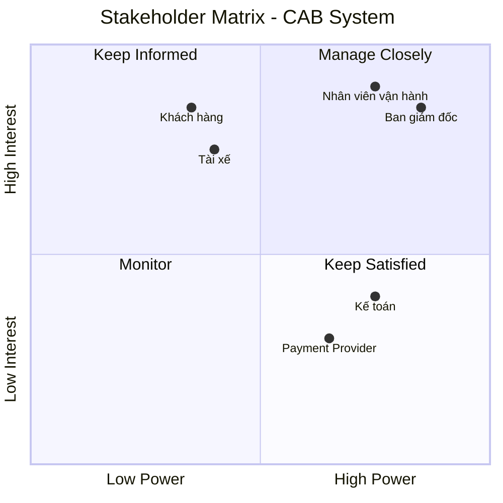

# 23655901_lehoangyen_cabsystem

# 1. Vấn đề danh nghiệp
- Đặt xe còn phụ thuộc nhiều vào tổng đài và thao tác thủ công.
- Việc tìm và phân công tài xế chưa tự động, khó mở rộng khi số lượng chuyến tăng.
- Khách hàng khó theo dõi trạng thái chuyến đi theo thời gian thực.
- Thông tin cước phí và thanh toán chưa được quản lý tập trung.
- Việc gửi thông báo chưa có kiến trúc linh hoạt để mở rộng nhiều kênh.
- Nhân viên vận hành thiếu công cụ để theo dõi, xử lý và quản lý chuyến.
- Khó kiểm soát quyền truy cập, bảo mật và lịch sử thao tác.
- Hệ thống chưa có khả năng mở rộng tốt khi nhu cầu tăng cao.
- Nhiều chính sách nghiệp vụ quan trọng vẫn chưa được xác định rõ.
# 2. Xác định stakeholder
| STT | Stakeholder | Vai trò |
|:---:|:--------:|:-----|
| 1 | Ban giám đốc | Định hướng và phê duyệt dự án |
| 2 | Khách hàng | Đặt xe thanh toán |
| 3 | Tài xế | Nhận và thực hiện chuyến |
| 4 | Nhân viên vận hành | Điều phối và xử lý hoạt động |
| 5 | Kế toán | Quản lý thanh toán và doanh thu |
| 6 | Payment Provider | Cung cấp dịch vụ thanh toán điện tử | vẽ lẠI CÁI matrix
# 3. Matrix 
## Stakeholder Matrix

Ma trận Stakeholder được phân loại dựa trên hai tiêu chí:
- **Power:** Mức độ quyền lực/ảnh hưởng đến dự án.
- **Interest:** Mức độ quan tâm đến dự án.

 # 4. Mục đích nghiệp vụ của các bên liên quan

| STT | Stakeholder | Mục đích nghiệp vụ |
|:---:|:---|:---|
| 1 | Ban giám đốc | Xây dựng nền tảng CAB có khả năng mở rộng, nâng cao hiệu quả kinh doanh, giảm chi phí vận hành và theo dõi doanh thu, hiệu suất hoạt động. |
| 2 | Khách hàng | Đặt xe nhanh chóng, theo dõi trạng thái chuyến, biết thông tin tài xế, thanh toán thuận tiện và đánh giá chất lượng dịch vụ. |
| 3 | Tài xế | Nhận các chuyến xe phù hợp, tối ưu thời gian hoạt động, cập nhật trạng thái chuyến và vị trí một cách thuận tiện. |
| 4 | Nhân viên vận hành | Quản lý và theo dõi chuyến đi, tài xế, khách hàng; nhanh chóng phát hiện và xử lý các trường hợp phát sinh. |
| 5 | Kế toán | Quản lý doanh thu, giao dịch thanh toán, đối soát và theo dõi tình trạng thanh toán của các chuyến đi. |
| 6 | Payment Provider | Cung cấp dịch vụ thanh toán điện tử an toàn, xử lý giao dịch và trả kết quả thanh toán cho hệ thống CAB. |
# 5. Phạm vi cơ bản của hệ thống
## Phạm vi cốt lõi của hệ thống

| STT | Module | Phạm vi cốt lõi |
|:---:|---|---|
| 1 | **Quản lý tài khoản & hồ sơ** | Đăng ký, đăng nhập, cập nhật thông tin khách hàng/tài xế; quản lý hồ sơ và phương tiện của tài xế. |
| 2 | **Đặt xe & tìm tài xế** | Khách hàng nhập điểm đón, điểm đến, chọn loại xe; hệ thống tìm và phân công tài xế phù hợp dựa trên vị trí, trạng thái và tiêu chí vận hành. |
| 3 | **Quản lý chuyến đi & vị trí** | Tài xế nhận chuyến, cập nhật trạng thái từ đến điểm đón, đón khách, đang di chuyển đến hoàn thành; cập nhật vị trí để hỗ trợ theo dõi và dự kiến thời gian đến. |
| 4 | **Tính cước & thanh toán** | Tính số tiền phải trả sau chuyến; hỗ trợ thanh toán tiền mặt và thanh toán điện tử thông qua Payment Provider; xử lý kết quả giao dịch. |
| 5 | **Thông báo** | Gửi thông báo cho khách hàng và tài xế về yêu cầu đặt xe, nhận chuyến, trạng thái chuyến, hoàn thành chuyến và kết quả thanh toán. |
| 6 | **Đánh giá & lịch sử chuyến** | Khách hàng xem lịch sử chuyến, số tiền phải trả và đánh giá tài xế sau khi hoàn thành chuyến. |
| 7 | **Quản lý vận hành** | Nhân viên vận hành quản lý khách hàng, tài xế, phương tiện, chuyến đi; theo dõi chuyến đang diễn ra và xử lý các trường hợp phát sinh. |
| 8 | **Quản lý giao dịch & báo cáo** | Tra cứu lịch sử giao dịch và cung cấp báo cáo cơ bản về số chuyến, doanh thu, tỷ lệ hoàn thành, tỷ lệ hủy và hiệu quả tài xế. |
| 9 | **Bảo mật & phân quyền** | Xác thực người dùng, phân quyền nhân viên/quản trị viên, bảo vệ dữ liệu cá nhân, vị trí và giao dịch; lưu vết các thao tác quan trọng. |

