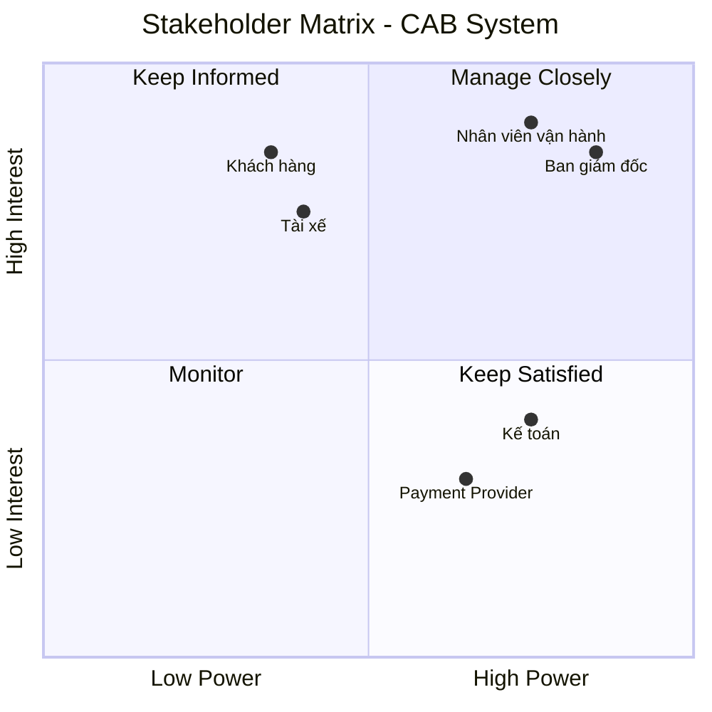

# 23655901_lehoangyen_cabsystem

# 1. Vấn đề danh nghiệp
- Đặt xe còn phụ thuộc nhiều vào tổng đài và thao tác thủ công.
- Việc tìm và phân công tài xế chưa tự động, khó mở rộng khi số lượng chuyến tăng.
- Khách hàng khó theo dõi trạng thái chuyến đi theo thời gian thực.
- Thông tin cước phí và thanh toán chưa được quản lý tập trung.
- Việc gửi thông báo chưa có kiến trúc linh hoạt để mở rộng nhiều kênh.
- Nhân viên vận hành thiếu công cụ để theo dõi, xử lý và quản lý chuyến.
- Khó kiểm soát quyền truy cập, bảo mật và lịch sử thao tác.
- Hệ thống chưa có khả năng mở rộng tốt khi nhu cầu tăng cao.
- Nhiều chính sách nghiệp vụ quan trọng vẫn chưa được xác định rõ.
# 2. Xác định stakeholder
| STT | Stakeholder | Vai trò |
|:---:|:--------:|:-----|
| 1 | Ban giám đốc | Định hướng và phê duyệt dự án |
| 2 | Khách hàng | Đặt xe thanh toán |
| 3 | Tài xế | Nhận và thực hiện chuyến |
| 4 | Nhân viên vận hành | Điều phối và xử lý hoạt động |
| 5 | Kế toán | Quản lý thanh toán và doanh thu |
| 6 | Payment Provider | Cung cấp dịch vụ thanh toán điện tử | vẽ lẠI CÁI matrix
# 3. Matrix 
## Stakeholder Matrix

Ma trận Stakeholder được phân loại dựa trên hai tiêu chí:
- **Power:** Mức độ quyền lực/ảnh hưởng đến dự án.
- **Interest:** Mức độ quan tâm đến dự án.

 # Mục đích nghiệp vụ của các bên liên quan

| STT | Stakeholder | Mục đích nghiệp vụ |
|:---:|:---|:---|
| 1 | Ban giám đốc | Xây dựng nền tảng CAB có khả năng mở rộng, nâng cao hiệu quả kinh doanh, giảm chi phí vận hành và theo dõi doanh thu, hiệu suất hoạt động. |
| 2 | Khách hàng | Đặt xe nhanh chóng, theo dõi trạng thái chuyến, biết thông tin tài xế, thanh toán thuận tiện và đánh giá chất lượng dịch vụ. |
| 3 | Tài xế | Nhận các chuyến xe phù hợp, tối ưu thời gian hoạt động, cập nhật trạng thái chuyến và vị trí một cách thuận tiện. |
| 4 | Nhân viên vận hành | Quản lý và theo dõi chuyến đi, tài xế, khách hàng; nhanh chóng phát hiện và xử lý các trường hợp phát sinh. |
| 5 | Kế toán | Quản lý doanh thu, giao dịch thanh toán, đối soát và theo dõi tình trạng thanh toán của các chuyến đi. |
| 6 | Payment Provider | Cung cấp dịch vụ thanh toán điện tử an toàn, xử lý giao dịch và trả kết quả thanh toán cho hệ thống CAB. |
# 4. Phạm vi cơ bản của hệ thống
## Phạm vi cốt lõi của hệ thống

| STT | Module | Phạm vi cốt lõi |
|:---:|---|---|
| 1 | **Quản lý tài khoản & hồ sơ** | Đăng ký, đăng nhập, cập nhật thông tin khách hàng/tài xế; quản lý hồ sơ và phương tiện của tài xế. |
| 2 | **Đặt xe & tìm tài xế** | Khách hàng nhập điểm đón, điểm đến, chọn loại xe; hệ thống tìm và phân công tài xế phù hợp dựa trên vị trí, trạng thái và tiêu chí vận hành. |
| 3 | **Quản lý chuyến đi & vị trí** | Tài xế nhận chuyến, cập nhật trạng thái từ đến điểm đón, đón khách, đang di chuyển đến hoàn thành; cập nhật vị trí để hỗ trợ theo dõi và dự kiến thời gian đến. |
| 4 | **Tính cước & thanh toán** | Tính số tiền phải trả sau chuyến; hỗ trợ thanh toán tiền mặt và thanh toán điện tử thông qua Payment Provider; xử lý kết quả giao dịch. |
| 5 | **Thông báo** | Gửi thông báo cho khách hàng và tài xế về yêu cầu đặt xe, nhận chuyến, trạng thái chuyến, hoàn thành chuyến và kết quả thanh toán. |
| 6 | **Đánh giá & lịch sử chuyến** | Khách hàng xem lịch sử chuyến, số tiền phải trả và đánh giá tài xế sau khi hoàn thành chuyến. |
| 7 | **Quản lý vận hành** | Nhân viên vận hành quản lý khách hàng, tài xế, phương tiện, chuyến đi; theo dõi chuyến đang diễn ra và xử lý các trường hợp phát sinh. |
| 8 | **Quản lý giao dịch & báo cáo** | Tra cứu lịch sử giao dịch và cung cấp báo cáo cơ bản về số chuyến, doanh thu, tỷ lệ hoàn thành, tỷ lệ hủy và hiệu quả tài xế. |
| 9 | **Bảo mật & phân quyền** | Xác thực người dùng, phân quyền nhân viên/quản trị viên, bảo vệ dữ liệu cá nhân, vị trí và giao dịch; lưu vết các thao tác quan trọng. |
# 5. Yêu cầu danh nghiệp
| ID | Business Requirement | Mô tả |
|:---:|---|---|
| BR-01 | **Quản lý tài khoản & hồ sơ** | Doanh nghiệp cần quản lý tài khoản, thông tin cá nhân của khách hàng và tài xế, đồng thời quản lý hồ sơ và phương tiện của tài xế. |
| BR-02 | **Đặt xe & tìm tài xế** | Doanh nghiệp cần cung cấp dịch vụ đặt xe và cơ chế tự động tìm, phân công tài xế phù hợp dựa trên vị trí, trạng thái sẵn sàng và tiêu chí vận hành. |
| BR-03 | **Quản lý chuyến đi & vị trí** | Doanh nghiệp cần quản lý toàn bộ quá trình thực hiện chuyến và theo dõi vị trí, trạng thái của tài xế trong chuyến đi. |
| BR-04 | **Tính cước & thanh toán** | Doanh nghiệp cần tính chính xác số tiền khách hàng phải trả và hỗ trợ thanh toán bằng tiền mặt hoặc thanh toán điện tử thông qua Payment Provider. |
| BR-05 | **Thông báo** | Doanh nghiệp cần đảm bảo khách hàng và tài xế nhận được thông tin về các sự kiện quan trọng trong quá trình đặt và thực hiện chuyến. |
| BR-06 | **Đánh giá & lịch sử chuyến** | Doanh nghiệp cần lưu trữ lịch sử chuyến đi và thu thập đánh giá của khách hàng để theo dõi chất lượng dịch vụ. |
| BR-07 | **Quản lý vận hành** | Doanh nghiệp cần hỗ trợ nhân viên vận hành theo dõi và quản lý khách hàng, tài xế, phương tiện và các chuyến đi đang diễn ra. |
| BR-08 | **Quản lý giao dịch & báo cáo** | Doanh nghiệp cần quản lý lịch sử giao dịch và cung cấp các báo cáo cơ bản về số chuyến, doanh thu, tỷ lệ hoàn thành, tỷ lệ hủy và hiệu quả tài xế. |
| BR-09 | **Bảo mật & phân quyền** | Doanh nghiệp cần đảm bảo người dùng được xác thực, dữ liệu được bảo vệ, quyền truy cập được kiểm soát và các thao tác quan trọng được lưu vết. |

# 6. Function Requirement 
# 8. Functional Requirements

## BR-01 – Quản lý tài khoản & hồ sơ

| ID | Functional Requirement |
|:---:|---|
| FR-01.1 | Hệ thống cho phép khách hàng đăng ký tài khoản. |
| FR-01.2 | Hệ thống cho phép khách hàng và tài xế đăng nhập, đăng xuất. |
| FR-01.3 | Hệ thống cho phép khách hàng cập nhật thông tin cá nhân. |
| FR-01.4 | Hệ thống cho phép tài xế cập nhật thông tin hồ sơ. |
| FR-01.5 | Hệ thống cho phép quản lý thông tin phương tiện của tài xế. |
| FR-01.6 | Hệ thống cho phép tài xế cập nhật trạng thái sẵn sàng nhận chuyến. |

---

## BR-02 – Đặt xe & tìm tài xế

| ID | Functional Requirement |
|:---:|---|
| FR-02.1 | Hệ thống cho phép khách hàng nhập điểm đón và điểm đến. |
| FR-02.2 | Hệ thống cho phép khách hàng lựa chọn loại xe/dịch vụ. |
| FR-02.3 | Hệ thống tạo yêu cầu đặt xe khi khách hàng xác nhận đặt xe. |
| FR-02.4 | Hệ thống xác định các tài xế phù hợp với yêu cầu đặt xe. |
| FR-02.5 | Hệ thống ưu tiên tài xế dựa trên vị trí, trạng thái sẵn sàng và tiêu chí vận hành. |
| FR-02.6 | Hệ thống gửi yêu cầu nhận chuyến đến tài xế phù hợp. |
| FR-02.7 | Hệ thống ghi nhận tài xế chấp nhận hoặc từ chối chuyến. |
| FR-02.8 | Khi tài xế từ chối hoặc không phản hồi, hệ thống tiếp tục tìm tài xế khác. |
| FR-02.9 | Khi không tìm được tài xế, hệ thống thông báo cho khách hàng. |

---

## BR-03 – Quản lý chuyến đi & vị trí

| ID | Functional Requirement |
|:---:|---|
| FR-03.1 | Hệ thống tạo chuyến khi tài xế chấp nhận yêu cầu. |
| FR-03.2 | Hệ thống cho phép tài xế cập nhật trạng thái chuyến. |
| FR-03.3 | Hệ thống hỗ trợ các trạng thái: Đã nhận chuyến, Đã đến điểm đón, Đã đón khách, Đang di chuyển, Hoàn thành. |
| FR-03.4 | Hệ thống cập nhật trạng thái chuyến cho khách hàng. |
| FR-03.5 | Hệ thống ghi nhận vị trí hiện tại của tài xế. |
| FR-03.6 | Hệ thống cung cấp thông tin vị trí và thời gian dự kiến tài xế đến cho khách hàng. |
| FR-03.7 | Hệ thống lưu lịch sử trạng thái của chuyến đi. |

---

## BR-04 – Tính cước & thanh toán

| ID | Functional Requirement |
|:---:|---|
| FR-04.1 | Hệ thống tính cước dựa trên loại dịch vụ và thông tin chuyến đi. |
| FR-04.2 | Hệ thống hiển thị số tiền khách hàng phải thanh toán. |
| FR-04.3 | Hệ thống hỗ trợ lựa chọn thanh toán tiền mặt. |
| FR-04.4 | Hệ thống hỗ trợ thanh toán điện tử thông qua Payment Provider. |
| FR-04.5 | Hệ thống ghi nhận kết quả giao dịch thanh toán. |
| FR-04.6 | Hệ thống thông báo cho khách hàng khi thanh toán thành công hoặc thất bại. |
| FR-04.7 | Hệ thống cho phép xử lý lại giao dịch thất bại theo chính sách doanh nghiệp. |
| FR-04.8 | Hệ thống không lưu trực tiếp thông tin nhạy cảm của thẻ hoặc tài khoản thanh toán. |

---

## BR-05 – Thông báo

| ID | Functional Requirement |
|:---:|---|
| FR-05.1 | Hệ thống thông báo cho khách hàng khi yêu cầu đặt xe được tiếp nhận. |
| FR-05.2 | Hệ thống thông báo khi tài xế nhận chuyến. |
| FR-05.3 | Hệ thống thông báo khi tài xế đến điểm đón. |
| FR-05.4 | Hệ thống thông báo khi chuyến hoàn thành. |
| FR-05.5 | Hệ thống thông báo kết quả thanh toán. |
| FR-05.6 | Hệ thống thông báo cho tài xế về chuyến mới và các thay đổi liên quan đến chuyến đang thực hiện. |
| FR-05.7 | Hệ thống hỗ trợ mở rộng thêm các kênh thông báo trong tương lai. |

---

## BR-06 – Đánh giá & lịch sử chuyến

| ID | Functional Requirement |
|:---:|---|
| FR-06.1 | Hệ thống lưu lịch sử các chuyến đi của khách hàng. |
| FR-06.2 | Hệ thống cho phép khách hàng xem chi tiết chuyến đã hoàn thành. |
| FR-06.3 | Hệ thống hiển thị số tiền đã thanh toán của chuyến. |
| FR-06.4 | Hệ thống cho phép khách hàng đánh giá tài xế sau khi chuyến hoàn thành. |
| FR-06.5 | Hệ thống lưu kết quả đánh giá để phục vụ quản lý chất lượng dịch vụ. |

---

## BR-07 – Quản lý vận hành

| ID | Functional Requirement |
|:---:|---|
| FR-07.1 | Hệ thống cung cấp giao diện quản trị cho nhân viên vận hành. |
| FR-07.2 | Nhân viên có thể tra cứu và quản lý khách hàng. |
| FR-07.3 | Nhân viên có thể tra cứu và quản lý tài xế. |
| FR-07.4 | Nhân viên có thể quản lý thông tin phương tiện. |
| FR-07.5 | Nhân viên có thể xem các chuyến đang diễn ra. |
| FR-07.6 | Nhân viên có thể kiểm tra trạng thái tài xế. |
| FR-07.7 | Nhân viên có thể hỗ trợ xử lý các chuyến bị lỗi hoặc phát sinh sự cố. |

---

## BR-08 – Quản lý giao dịch & báo cáo

| ID | Functional Requirement |
|:---:|---|
| FR-08.1 | Hệ thống lưu thông tin giao dịch thanh toán. |
| FR-08.2 | Nhân viên có thể tra cứu lịch sử giao dịch. |
| FR-08.3 | Hệ thống cung cấp báo cáo số lượng chuyến. |
| FR-08.4 | Hệ thống cung cấp báo cáo doanh thu. |
| FR-08.5 | Hệ thống cung cấp tỷ lệ chuyến hoàn thành và tỷ lệ hủy. |
| FR-08.6 | Hệ thống cung cấp thông tin về hiệu quả hoạt động của tài xế. |

---

## BR-09 – Bảo mật & phân quyền

| ID | Functional Requirement |
|:---:|---|
| FR-09.1 | Hệ thống yêu cầu xác thực trước khi sử dụng các chức năng cần tài khoản. |
| FR-09.2 | Hệ thống phân quyền người dùng theo vai trò. |
| FR-09.3 | Hệ thống giới hạn quyền truy cập các chức năng quản trị theo vai trò. |
| FR-09.4 | Hệ thống bảo vệ thông tin cá nhân, phương tiện, vị trí và giao dịch. |
| FR-09.5 | Hệ thống ghi nhận audit log đối với các thao tác quan trọng. |
| FR-09.6 | Hệ thống cho phép tra cứu log phục vụ kiểm tra và xử lý sự cố. |
# 7. Vẽ Usecase 
# 8. Đặc tả Usecase
# 9. Phân tích quy trình nghiệp vụ
