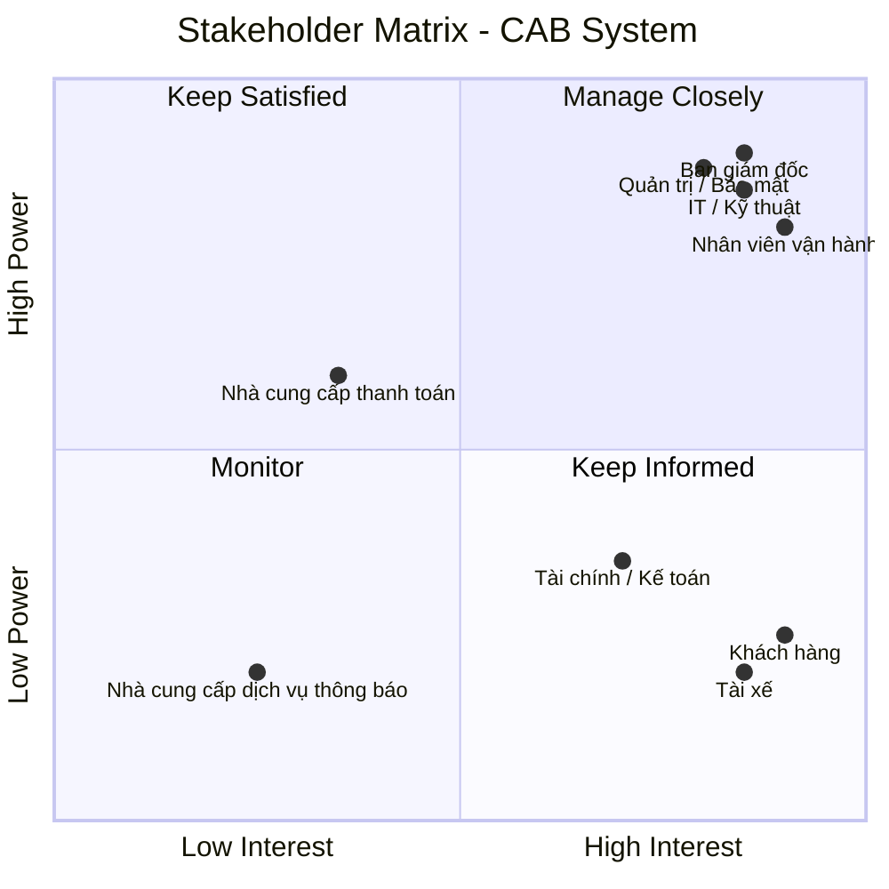
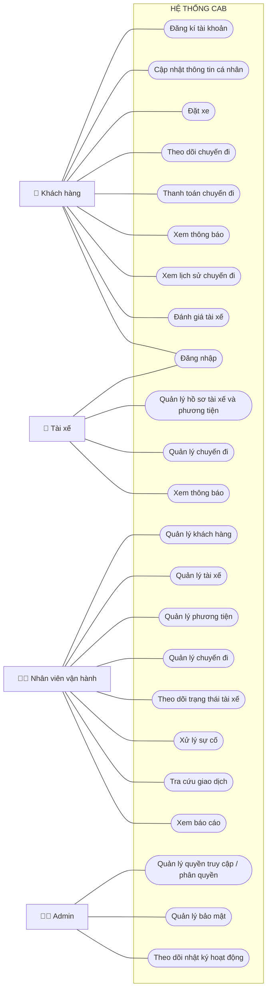
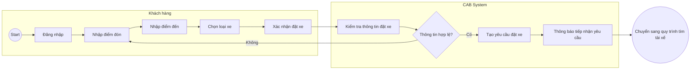
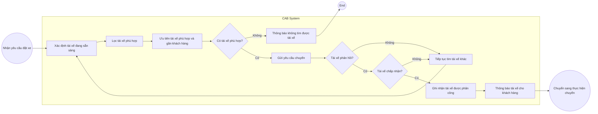
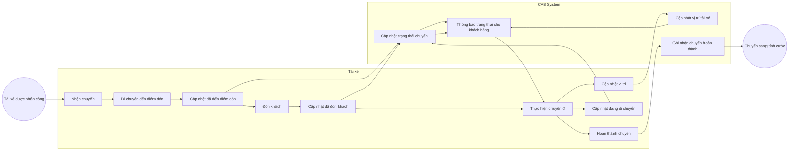
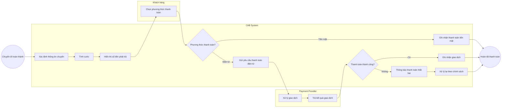
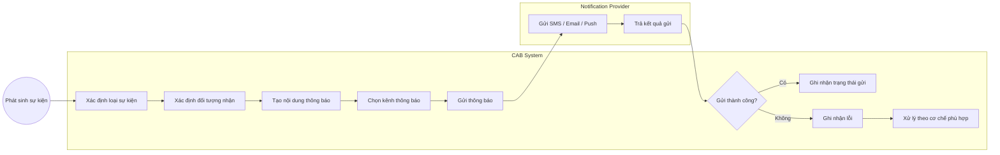
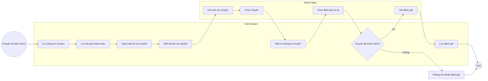
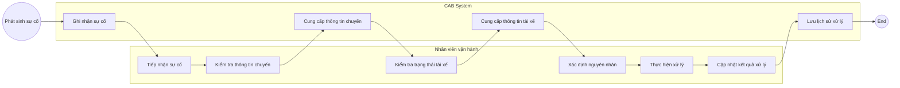

# 23655901_lehoangyen_cabsystem

# 1. Vấn đề danh nghiệp
- Đặt xe còn phụ thuộc nhiều vào tổng đài và thao tác thủ công.
- Việc tìm và phân công tài xế chưa tự động, khó mở rộng khi số lượng chuyến tăng.
- Khách hàng khó theo dõi trạng thái chuyến đi theo thời gian thực.
- Thông tin cước phí và thanh toán chưa được quản lý tập trung.
- Việc gửi thông báo chưa có kiến trúc linh hoạt để mở rộng nhiều kênh.
- Nhân viên vận hành thiếu công cụ để theo dõi, xử lý và quản lý chuyến.
- Khó kiểm soát quyền truy cập, bảo mật và lịch sử thao tác.
- Hệ thống chưa có khả năng mở rộng tốt khi nhu cầu tăng cao.
- Nhiều chính sách nghiệp vụ quan trọng vẫn chưa được xác định rõ.
# 2. Xác định stakeholder
| STT | Stakeholder | Vai trò  |
| --- | --- | --- |
| 1 | **Ban giám đốc** | Định hướng dự án, phê duyệt ngân sách, theo dõi hiệu quả kinh doanh và báo cáo tổng thể. |
| 2 | **Khách hàng** | Đăng ký, đặt xe, theo dõi chuyến, thanh toán, xem lịch sử và đánh giá tài xế. |
| 3 | **Tài xế** | Quản lý hồ sơ, phương tiện, trạng thái hoạt động; nhận và thực hiện chuyến; cập nhật trạng thái và vị trí. |
| 4 | **Nhân viên vận hành** | Quản lý khách hàng, tài xế, phương tiện, chuyến đi; giám sát và xử lý các trường hợp bất thường. |
| 5 | **Bộ phận IT / Kỹ thuật** | Phát triển, triển khai, vận hành, bảo trì, đảm bảo hiệu năng, khả năng mở rộng và tích hợp hệ thống. |
| 6 | **Bộ phận Tài chính / Kế toán** | Theo dõi doanh thu, giao dịch, đối soát thanh toán và hỗ trợ báo cáo tài chính. |
| 7 | **Bộ phận Quản trị / Bảo mật** | Quản lý quyền truy cập, bảo vệ dữ liệu, kiểm tra nhật ký thao tác và xử lý các vấn đề bảo mật. |
| 8 | **Nhà cung cấp thanh toán** | Xử lý các giao dịch thanh toán điện tử và trả kết quả giao dịch cho hệ thống CAB. |
| 9 | **Nhà cung cấp dịch vụ thông báo** | Cung cấp SMS, email, push notification và hỗ trợ mở rộng thêm các kênh thông báo. |

# Stakeholder Matrix

Ma trận Stakeholder được phân loại dựa trên hai tiêu chí:
- **Power:** Mức độ quyền lực/ảnh hưởng đến dự án.
- **Interest:** Mức độ quan tâm đến dự án.

 # 3. Mục đích nghiệp vụ của các bên liên quan
## Mục đích của các Stakeholder
| STT | Stakeholder | Mục đích / Mối quan tâm |
| --- | --- | --- |
| 1 | **Ban giám đốc** | Nâng cao hiệu quả kinh doanh, kiểm soát hoạt động và có dữ liệu, báo cáo để hỗ trợ ra quyết định. |
| 2 | **Khách hàng** | Đặt xe thuận tiện, biết trạng thái chuyến, thông tin tài xế, thời gian dự kiến đến; thanh toán và đánh giá dịch vụ dễ dàng. |
| 3 | **Tài xế** | Nhận các chuyến phù hợp, quản lý trạng thái hoạt động, cập nhật vị trí và thực hiện chuyến thuận tiện. |
| 4 | **Nhân viên vận hành** | Quản lý, giám sát khách hàng, tài xế, phương tiện và chuyến đi; nhanh chóng phát hiện và xử lý các trường hợp bất thường. |
| 5 | **Bộ phận IT / Kỹ thuật** | Đảm bảo hệ thống hoạt động ổn định, bảo mật, có khả năng mở rộng và dễ dàng tích hợp hoặc thay đổi các thành phần kỹ thuật. |
| 6 | **Bộ phận Tài chính / Kế toán** | Theo dõi doanh thu, giao dịch, đối soát thanh toán và cung cấp dữ liệu phục vụ báo cáo tài chính. |
| 7 | **Bộ phận Quản trị / Bảo mật** | Kiểm soát quyền truy cập, bảo vệ dữ liệu và theo dõi các thao tác quan trọng để phục vụ kiểm tra, xử lý sự cố. |
| 8 | **Nhà cung cấp thanh toán** | Cung cấp dịch vụ thanh toán điện tử an toàn, ổn định và xử lý các giao dịch từ hệ thống CAB. |
| 9 | **Nhà cung cấp dịch vụ thông báo** | Cung cấp các kênh thông báo như SMS, email, push notification và hỗ trợ mở rộng thêm các kênh trong tương lai. |

## Business Goals – Mục tiêu nghiệp vụ

| ID | Business Goal | Ý nghĩa |
| --- | --- | --- |
| **BG01** | **Tự động hóa quy trình đặt và phân công xe** | Giảm sự phụ thuộc vào tổng đài và việc phân công tài xế thủ công. |
| **BG02** | **Nâng cao trải nghiệm khách hàng** | Giúp khách hàng dễ dàng đặt xe, theo dõi trạng thái chuyến, tài xế và thời gian dự kiến đến. |
| **BG03** | **Tối ưu hóa việc phân công tài xế** | Tự động tìm và ưu tiên tài xế phù hợp, gần khách hàng và đang sẵn sàng nhận chuyến. |
| **BG04** | **Quản lý tập trung hoạt động vận hành** | Cung cấp nền tảng quản lý khách hàng, tài xế, phương tiện và chuyến đi cho nhân viên vận hành. |
| **BG05** | **Nâng cao hiệu quả quản lý doanh thu và thanh toán** | Chuẩn hóa việc tính cước, quản lý giao dịch và hỗ trợ thanh toán tiền mặt, điện tử. |
| **BG06** | **Nâng cao khả năng giám sát và ra quyết định** | Cung cấp dữ liệu và báo cáo về số chuyến, doanh thu, tỷ lệ hoàn thành, hủy chuyến và hiệu quả tài xế. |
| **BG07** | **Đảm bảo khả năng mở rộng của hệ thống** | Cho phép hệ thống phục vụ số lượng lớn khách hàng, tài xế và mở rộng các thành phần khi tải tăng. |
| **BG08** | **Tăng tính linh hoạt trong phát triển sản phẩm** | Cho phép bổ sung dịch vụ, phương thức thanh toán, kênh thông báo hoặc thay đổi thành phần kỹ thuật. |
| **BG09** | **Đảm bảo bảo mật và kiểm soát truy cập** | Bảo vệ thông tin cá nhân, phương tiện, vị trí, giao dịch và kiểm soát các thao tác quản trị. |
| **BG10** | **Nâng cao độ tin cậy và tính sẵn sàng** | Hạn chế ảnh hưởng dây chuyền khi một thành phần như thanh toán hoặc thông báo gặp lỗi. |
# 4. Phạm vi cơ bản của hệ thống
| STT | Phạm vi hệ thống | Chức năng chính |
|---|---|---|
| 1 | **Quản lý tài khoản & hồ sơ** | Đăng ký, đăng nhập, cập nhật thông tin, quản lý hồ sơ tài xế và phương tiện. |
| 2 | **Đặt xe** | Nhập điểm đón, điểm đến, chọn loại xe và tạo yêu cầu đặt xe. |
| 3 | **Tìm tài xế** | Tìm và phân công tài xế phù hợp dựa trên vị trí và trạng thái |
| 4 | **Quản lý chuyến đi & vị trí** | Nhận chuyến,hủy chuyến, cập nhật trạng thái chuyến và theo dõi vị trí tài xế. |
| 5 | **Tính cước & thanh toán** | Tính cước, thanh toán tiền mặt hoặc điện tử và xử lý giao dịch. |
| 6 | **Thông báo** | Thông báo về đặt xe, nhận chuyến, trạng thái chuyến và thanh toán. |
| 7 | **Đánh giá & lịch sử chuyến** | Xem lịch sử chuyến, số tiền và đánh giá tài xế. |
| 8 | **Quản lý vận hành** | Quản lý khách hàng, tài xế, phương tiện, chuyến đi và xử lý sự cố. |
| 9 | **Giao dịch & báo cáo** | Tra cứu giao dịch và xem báo cáo hoạt động, doanh thu. |
| 10 | **Bảo mật & phân quyền** | Xác thực, phân quyền và bảo vệ dữ liệu hệ thống. |
# 5. Yêu cầu danh nghiệp
## Business Requirements
| **ID Business Requirement** | **Business Requirement** |
| --------------------------- | ------------------------ |
| BR-01 | Hỗ trợ quản lý tài khoản, hồ sơ khách hàng, tài xế và phương tiện. |
| BR-02 | Hỗ trợ khách hàng nhập điểm đón, điểm đến, lựa chọn loại xe và tạo yêu cầu đặt xe. |
| BR-03 | Tự động tìm và phân công tài xế phù hợp dựa trên vị trí và trạng thái hoạt động. |
| BR-04 | Hỗ trợ tài xế nhận hoặc từ chối chuyến, hủy chuyến, cập nhật trạng thái và theo dõi vị trí trong quá trình thực hiện chuyến. |
| BR-05 | Tính toán cước và hỗ trợ thanh toán chuyến đi bằng tiền mặt hoặc phương thức điện tử. |
| BR-06 | Cung cấp thông báo về yêu cầu đặt xe, nhận chuyến, trạng thái chuyến và kết quả thanh toán. |
| BR-07 | Hỗ trợ khách hàng xem lịch sử chuyến đi, chi phí và đánh giá tài xế. |
| BR-08 | Hỗ trợ nhân viên vận hành quản lý khách hàng, tài xế, phương tiện, chuyến đi và xử lý sự cố. |
| BR-09 | Hỗ trợ tra cứu giao dịch và cung cấp báo cáo về hoạt động, doanh thu và hiệu suất tài xế. |
| BR-10 | Đảm bảo hệ thống hoạt động ổn định, bảo mật, phân quyền và có khả năng mở rộng trong tương lai. |
# 6. Functional Requirement
| BR | Mã FR | Functional Requirement |
|---|---|---|
| **BR-01** | FR-01 | Hệ thống hỗ trợ khách hàng đăng ký tài khoản. |
| | FR-02 | Hệ thống hỗ trợ khách hàng đăng nhập. |
| | FR-03 | Hệ thống hỗ trợ khách hàng cập nhật thông tin cá nhân. |
| | FR-04 | Hệ thống hỗ trợ quản lý hồ sơ tài xế và thông tin phương tiện. |
| **BR-02** | FR-05 | Hệ thống hỗ trợ khách hàng nhập điểm đón. |
| | FR-06 | Hệ thống hỗ trợ khách hàng nhập điểm đến. |
| | FR-07 | Hệ thống hỗ trợ khách hàng lựa chọn loại xe. |
| | FR-08 | Hệ thống hỗ trợ khách hàng tạo yêu cầu đặt xe. |
| **BR-03** | FR-09 | Hệ thống xác định tài xế phù hợp dựa trên vị trí. |
| | FR-10 | Hệ thống kiểm tra trạng thái sẵn sàng của tài xế. |
| | FR-11 | Hệ thống phân công tài xế phù hợp cho chuyến đi. |
| | FR-12 | Hệ thống tiếp tục tìm tài xế khác khi tài xế từ chối hoặc không phản hồi. |
| | FR-13 | Hệ thống thông báo cho khách hàng khi không tìm được tài xế. |
| **BR-04** | FR-14 | Hệ thống hỗ trợ tài xế nhận chuyến. |
| | FR-15 | Hệ thống hỗ trợ tài xế từ chối chuyến. |
| | FR-16 | Hệ thống hỗ trợ cập nhật trạng thái chuyến đi. |
| | FR-17 | Hệ thống hỗ trợ theo dõi vị trí tài xế. |
| **BR-05** | FR-18 | Hệ thống tính cước chuyến đi. |
| | FR-19 | Hệ thống hỗ trợ thanh toán bằng tiền mặt. |
| | FR-20 | Hệ thống hỗ trợ thanh toán bằng phương thức điện tử. |
| | FR-21 | Hệ thống cập nhật kết quả thanh toán. |
| | FR-22 | Hệ thống xử lý trường hợp thanh toán điện tử thất bại. |
| **BR-06** | FR-23 | Hệ thống thông báo khi yêu cầu đặt xe được tạo. |
| | FR-24 | Hệ thống thông báo khi tài xế nhận chuyến. |
| | FR-25 | Hệ thống thông báo khi tài xế đã đến điểm đón. |
| | FR-26 | Hệ thống thông báo khi chuyến đi hoàn thành. |
| | FR-27 | Hệ thống thông báo kết quả thanh toán. |
| **BR-07** | FR-28 | Hệ thống hỗ trợ khách hàng xem lịch sử chuyến đi. |
| | FR-29 | Hệ thống hỗ trợ khách hàng đánh giá tài xế sau khi hoàn thành chuyến. |
| **BR-08** | FR-30 | Hệ thống hỗ trợ nhân viên vận hành quản lý khách hàng. |
| | FR-31 | Hệ thống hỗ trợ nhân viên vận hành quản lý tài xế. |
| | FR-32 | Hệ thống hỗ trợ nhân viên vận hành quản lý phương tiện. |
| | FR-33 | Hệ thống hỗ trợ nhân viên vận hành quản lý và theo dõi chuyến đi. |
| | FR-34 | Hệ thống hỗ trợ nhân viên vận hành theo dõi trạng thái tài xế. |
| | FR-35 | Hệ thống hỗ trợ nhân viên vận hành ghi nhận và xử lý sự cố. |
| **BR-09** | FR-36 | Hệ thống hỗ trợ tra cứu lịch sử giao dịch. |
| | FR-37 | Hệ thống cung cấp báo cáo số lượng chuyến đi. |
| | FR-38 | Hệ thống cung cấp báo cáo doanh thu. |
| | FR-39 | Hệ thống cung cấp báo cáo tỷ lệ hoàn thành và hủy chuyến. |
| | FR-40 | Hệ thống cung cấp báo cáo hiệu suất tài xế. |
| **BR-10** | FR-41 | Hệ thống thực hiện xác thực người dùng. |
| | FR-42 | Hệ thống thực hiện phân quyền người dùng theo vai trò. |
| | FR-43 | Hệ thống bảo vệ dữ liệu người dùng và dữ liệu giao dịch. |
| | FR-44 | Hệ thống ghi nhận nhật ký hoạt động để phục vụ kiểm tra và truy vết. |
# 7. Vẽ Usecase 

# 8. Đặc tả Usecase
# 8. Use Case Specification
# KHÁCH HÀNG

## UC-KH01 – Quản lý tài khoản

| Thành phần         | Nội dung                                                                  |
| ------------------ | ------------------------------------------------------------------------- |
| **Tên Use Case**   | Quản lý tài khoản                                                         |
| **Actor**          | Khách hàng                                                                |
| **Mục tiêu**       | Cho phép khách hàng đăng ký, đăng nhập và cập nhật thông tin cá nhân.    |
| **Tiền điều kiện** | Khách hàng truy cập vào hệ thống CAB.                                     |
| **Hậu điều kiện**  | Tài khoản hoặc thông tin cá nhân được cập nhật thành công.                |
| **Luồng chính**|                                                                                 |
| **Actor**                                      | **Hệ thống**                                      |
| ---------------------------------------------- | ------------------------------------------------- |
| 1. Khách hàng chọn đăng ký tài khoản.          | 2. Hiển thị giao diện đăng ký.                   |
| 3. Khách hàng nhập thông tin đăng ký.          | 4. Kiểm tra thông tin được cung cấp.              |
| 5. Khách hàng xác nhận đăng ký.                | 6. Tạo tài khoản và thông báo đăng ký thành công.|
| 7. Khách hàng chọn đăng nhập.                  | 8. Hiển thị giao diện đăng nhập.                 |
| 9. Khách hàng nhập thông tin đăng nhập.        | 10. Kiểm tra và xác thực thông tin tài khoản.    |
| 11. Khách hàng xác nhận đăng nhập.             | 12. Đăng nhập và cho phép truy cập hệ thống.     |
| 13. Khách hàng chọn cập nhật thông tin cá nhân.| 14. Hiển thị thông tin hồ sơ hiện tại.           |
| 15. Khách hàng nhập thông tin mới và xác nhận. | 16. Kiểm tra và lưu thông tin hồ sơ.             |
|                                                 | 17. Thông báo cập nhật thông tin thành công.     |
|**Luồng thay thế**|                                                                             |
|- **Tại bước 1:** Khách hàng đã có tài khoản → Chuyển sang bước 7 để đăng nhập.|
|- **Tại bước 13:** Khách hàng không cập nhật thông tin cá nhân → Kết thúc Use Case.|
|**Luồng ngoại lệ**|                                                                             |
|- **Tại bước 4:** Thông tin đăng ký không hợp lệ → Hệ thống thông báo lỗi và yêu cầu nhập lại.|
|- **Tại bước 4:** Tài khoản đã tồn tại → Hệ thống thông báo và yêu cầu sử dụng thông tin khác.|
|- **Tại bước 10:** Thông tin đăng nhập không chính xác → Hệ thống thông báo đăng nhập thất bại.|
|- **Tại bước 16:** Thông tin cập nhật không hợp lệ → Hệ thống thông báo lỗi và yêu cầu nhập lại.|

---

## UC-KH02 – Đặt xe

| Thành phần         | Nội dung                                                                  |
| ------------------ | ------------------------------------------------------------------------- |
| **Tên Use Case**   | Đặt xe                                                                    |
| **Actor**          | Khách hàng                                                                |
| **Mục tiêu**       | Cho phép khách hàng nhập thông tin chuyến đi và tạo yêu cầu đặt xe.      |
| **Tiền điều kiện** | Khách hàng đã đăng nhập vào hệ thống CAB.                                |
| **Hậu điều kiện**  | Yêu cầu đặt xe được tạo thành công và chuyển sang quá trình tìm tài xế.  |

### Luồng chính

| **Actor**                                      | **Hệ thống**                                      |
| ---------------------------------------------- | ------------------------------------------------- |
| 1. Khách hàng chọn chức năng đặt xe.           | 2. Hiển thị giao diện đặt xe.                    |
| 3. Khách hàng nhập điểm đón.                   | 4. Kiểm tra thông tin điểm đón.                  |
| 5. Khách hàng nhập điểm đến.                   | 6. Kiểm tra thông tin điểm đến.                  |
| 7. Khách hàng lựa chọn loại xe.                | 8. Ghi nhận loại xe được lựa chọn.               |
| 9. Khách hàng xác nhận yêu cầu đặt xe.          | 10. Kiểm tra thông tin đặt xe.                   |
|                                                 | 11. Tạo yêu cầu đặt xe.                           |
|                                                 | 12. Chuyển yêu cầu sang quá trình tìm tài xế.    |
|                                                 | 13. Thông báo yêu cầu đặt xe đã được tạo.        |

### Luồng thay thế

- **Tại bước 7:** Khách hàng thay đổi loại xe → Hệ thống cập nhật loại xe được lựa chọn.
- **Tại bước 9:** Khách hàng chỉnh sửa thông tin chuyến đi → Hệ thống cho phép cập nhật điểm đón, điểm đến hoặc loại xe.

### Luồng ngoại lệ

- **Tại bước 4:** Điểm đón không hợp lệ → Hệ thống yêu cầu khách hàng nhập lại.
- **Tại bước 6:** Điểm đến không hợp lệ → Hệ thống yêu cầu khách hàng nhập lại.
- **Tại bước 10:** Thông tin đặt xe không đầy đủ → Hệ thống yêu cầu bổ sung thông tin.
- **Tại bước 11:** Không thể tạo yêu cầu đặt xe → Hệ thống thông báo lỗi và yêu cầu thử lại.

---

## UC-KH03 – Theo dõi chuyến đi

| Thành phần         | Nội dung                                                                  |
| ------------------ | ------------------------------------------------------------------------- |
| **Tên Use Case**   | Theo dõi chuyến đi                                                        |
| **Actor**          | Khách hàng                                                                |
| **Mục tiêu**       | Cho phép khách hàng theo dõi vị trí tài xế và trạng thái chuyến đi.      |
| **Tiền điều kiện** | Khách hàng đã đặt xe và chuyến đi đang được thực hiện.                   |
| **Hậu điều kiện**  | Khách hàng xem được vị trí và trạng thái hiện tại của chuyến đi.         |

### Luồng chính

| **Actor**                                     | **Hệ thống**                                      |
| --------------------------------------------- | ------------------------------------------------- |
| 1. Khách hàng chọn chuyến đi đang thực hiện.  | 2. Hiển thị thông tin chuyến đi.                 |
| 3. Khách hàng yêu cầu theo dõi chuyến đi.     | 4. Lấy thông tin vị trí hiện tại của tài xế.     |
| 5. Khách hàng xem vị trí tài xế.              | 6. Hiển thị vị trí tài xế trên hệ thống.         |
| 7. Khách hàng xem trạng thái chuyến đi.       | 8. Hiển thị trạng thái hiện tại của chuyến đi.   |
| 9. Khách hàng tiếp tục theo dõi chuyến đi.    | 10. Cập nhật thông tin vị trí và trạng thái.     |

### Luồng thay thế

- **Tại bước 5:** Khách hàng chỉ xem trạng thái chuyến đi → Hệ thống hiển thị trạng thái hiện tại.
- **Tại bước 9:** Chuyến đi đã hoàn thành → Hệ thống hiển thị trạng thái hoàn thành và kết thúc theo dõi.

### Luồng ngoại lệ

- **Tại bước 4:** Không nhận được dữ liệu vị trí → Hệ thống thông báo vị trí chưa được cập nhật.
- **Tại bước 6:** Dữ liệu vị trí không khả dụng → Hệ thống thông báo không thể hiển thị vị trí tài xế.

---

## UC-KH04 – Thanh toán chuyến đi

| Thành phần         | Nội dung                                                                    |
| ------------------ | --------------------------------------------------------------------------- |
| **Tên Use Case**   | Thanh toán chuyến đi                                                        |
| **Actor**          | Khách hàng                                                                   |
| **Mục tiêu**       | Cho phép khách hàng thanh toán chi phí chuyến đi bằng tiền mặt hoặc điện tử. |
| **Tiền điều kiện** | Chuyến đi đã hoàn thành và hệ thống đã tính cước.                           |
| **Hậu điều kiện**  | Kết quả thanh toán được ghi nhận vào hệ thống.                               |

### Luồng chính

| **Actor**                                      | **Hệ thống**                                      |
| ---------------------------------------------- | ------------------------------------------------- |
| 1. Khách hàng xem thông tin thanh toán.        | 2. Tính và hiển thị cước chuyến đi.              |
| 3. Khách hàng chọn phương thức thanh toán.     | 4. Hiển thị phương thức thanh toán tương ứng.    |
| 5. Khách hàng xác nhận thanh toán.             | 6. Tiếp nhận và xử lý yêu cầu thanh toán.        |
|                                                 | 7. Cập nhật kết quả thanh toán.                  |
|                                                 | 8. Thông báo kết quả thanh toán cho khách hàng.  |

### Luồng thay thế

- **Tại bước 3:** Khách hàng chọn thanh toán bằng tiền mặt → Hệ thống ghi nhận phương thức thanh toán tiền mặt.
- **Tại bước 3:** Khách hàng chọn thanh toán điện tử → Hệ thống chuyển yêu cầu đến đơn vị cung cấp thanh toán.
- **Tại bước 5:** Khách hàng thực hiện thanh toán điện tử lại → Hệ thống tiếp nhận và xử lý yêu cầu thanh toán lại.

### Luồng ngoại lệ

- **Tại bước 2:** Không thể tính cước → Hệ thống thông báo lỗi và không cho phép tiếp tục thanh toán.
- **Tại bước 6:** Thanh toán điện tử thất bại → Hệ thống thông báo thanh toán thất bại.
- **Tại bước 7:** Không thể cập nhật kết quả thanh toán → Hệ thống thông báo lỗi và ghi nhận trạng thái chưa hoàn tất.

---

## UC-KH05 – Xem thông báo

| Thành phần         | Nội dung                                                                  |
| ------------------ | ------------------------------------------------------------------------- |
| **Tên Use Case**   | Xem thông báo                                                              |
| **Actor**          | Khách hàng                                                                 |
| **Mục tiêu**       | Cho phép khách hàng xem các thông báo liên quan đến đặt xe, chuyến đi và thanh toán. |
| **Tiền điều kiện** | Khách hàng đã đăng nhập vào hệ thống CAB.                                 |
| **Hậu điều kiện**  | Khách hàng xem được nội dung thông báo.                                    |

### Luồng chính

| **Actor**                                | **Hệ thống**                                      |
| ---------------------------------------- | ------------------------------------------------- |
| 1. Khách hàng chọn chức năng thông báo. | 2. Hiển thị danh sách thông báo.                 |
| 3. Khách hàng chọn một thông báo.       | 4. Hiển thị nội dung thông báo.                  |
| 5. Khách hàng xem thông báo.            | 6. Ghi nhận thông báo đã được xem.               |

### Luồng thay thế

- **Tại bước 3:** Khách hàng không chọn thông báo cụ thể → Hệ thống tiếp tục hiển thị danh sách thông báo.
- **Tại bước 5:** Khách hàng chỉ xem danh sách thông báo → Hệ thống giữ nguyên danh sách thông báo.

### Luồng ngoại lệ

- **Tại bước 2:** Không có thông báo → Hệ thống hiển thị danh sách thông báo trống.
- **Tại bước 2:** Không thể tải thông báo → Hệ thống thông báo lỗi và yêu cầu thử lại.

---

## UC-KH06 – Xem lịch sử chuyến đi

| Thành phần         | Nội dung                                                                  |
| ------------------ | ------------------------------------------------------------------------- |
| **Tên Use Case**   | Xem lịch sử chuyến đi                                                      |
| **Actor**          | Khách hàng                                                                 |
| **Mục tiêu**       | Cho phép khách hàng xem lại các chuyến đi đã thực hiện.                    |
| **Tiền điều kiện** | Khách hàng đã đăng nhập vào hệ thống CAB.                                 |
| **Hậu điều kiện**  | Lịch sử chuyến đi được hiển thị cho khách hàng.                            |

### Luồng chính

| **Actor**                                       | **Hệ thống**                                      |
| ----------------------------------------------- | ------------------------------------------------- |
| 1. Khách hàng chọn chức năng lịch sử chuyến đi. | 2. Truy xuất lịch sử chuyến đi của khách hàng.   |
| 3. Khách hàng chọn một chuyến đi.               | 4. Hiển thị thông tin chi tiết chuyến đi.        |
| 5. Khách hàng xem thông tin chuyến đi.          | 6. Hiển thị thông tin tương ứng.                 |

### Luồng thay thế

- **Tại bước 3:** Khách hàng không chọn chuyến đi cụ thể → Hệ thống chỉ hiển thị danh sách lịch sử chuyến đi.
- **Tại bước 3:** Khách hàng chọn một chuyến đi khác → Hệ thống hiển thị thông tin của chuyến đi được chọn.

### Luồng ngoại lệ

- **Tại bước 2:** Không có lịch sử chuyến đi → Hệ thống thông báo khách hàng chưa có chuyến đi.
- **Tại bước 4:** Không tìm thấy thông tin chuyến đi → Hệ thống thông báo dữ liệu không tồn tại.

---

## UC-KH07 – Đánh giá tài xế

| Thành phần         | Nội dung                                                                  |
| ------------------ | ------------------------------------------------------------------------- |
| **Tên Use Case**   | Đánh giá tài xế                                                            |
| **Actor**          | Khách hàng                                                                 |
| **Mục tiêu**       | Cho phép khách hàng đánh giá tài xế sau khi chuyến đi hoàn thành.          |
| **Tiền điều kiện** | Chuyến đi đã hoàn thành và khách hàng chưa đánh giá tài xế.                |
| **Hậu điều kiện**  | Đánh giá của khách hàng được ghi nhận vào hệ thống.                        |

### Luồng chính

| **Actor**                                      | **Hệ thống**                                      |
| ---------------------------------------------- | ------------------------------------------------- |
| 1. Khách hàng chọn chuyến đi đã hoàn thành.    | 2. Hiển thị chức năng đánh giá tài xế.            |
| 3. Khách hàng nhập đánh giá.                   | 4. Kiểm tra thông tin đánh giá.                  |
| 5. Khách hàng xác nhận gửi đánh giá.           | 6. Lưu đánh giá vào hệ thống.                    |
|                                                 | 7. Thông báo đánh giá đã được ghi nhận.          |

### Luồng thay thế

- **Tại bước 3:** Khách hàng chỉ đánh giá mức điểm → Hệ thống ghi nhận mức điểm đánh giá.
- **Tại bước 3:** Khách hàng đánh giá mức điểm và nhập nội dung → Hệ thống ghi nhận cả điểm và nội dung đánh giá.

### Luồng ngoại lệ

- **Tại bước 1:** Chuyến đi chưa hoàn thành → Hệ thống không cho phép đánh giá.
- **Tại bước 4:** Thông tin đánh giá không hợp lệ → Hệ thống yêu cầu khách hàng nhập lại.
- **Tại bước 6:** Khách hàng đã đánh giá trước đó → Hệ thống thông báo không thể đánh giá lại.

# 9. Phân tích quy trình nghiệp vụ

Phân tích quy trình nghiệp vụ nhằm mô tả trình tự thực hiện các hoạt động chính của hệ thống CAB System và sự phối hợp giữa khách hàng, tài xế, hệ thống, nhân viên vận hành và các nhà cung cấp bên ngoài.

## 9.1. Quy trình đặt xe

### Mô tả

| STT | Đối tượng  | Hoạt động                                                |
| --: | ---------- | -------------------------------------------------------- |
|   1 | Khách hàng | Đăng nhập vào hệ thống.                                  |
|   2 | Khách hàng | Nhập điểm đón và điểm đến.                               |
|   3 | Khách hàng | Lựa chọn loại xe.                                        |
|   4 | Khách hàng | Xác nhận thông tin đặt xe.                               |
|   5 | Hệ thống   | Kiểm tra thông tin đặt xe.                               |
|   6 | Hệ thống   | Nếu thông tin không hợp lệ, yêu cầu khách hàng nhập lại. |
|   7 | Hệ thống   | Nếu thông tin hợp lệ, tạo yêu cầu đặt xe.                |
|   8 | Hệ thống   | Thông báo hệ thống đã tiếp nhận yêu cầu.                 |
|   9 | Hệ thống   | Chuyển yêu cầu sang quy trình tìm và phân công tài xế.   |

---

## 9.2. Quy trình tìm và phân công tài xế

### Mô tả

| STT | Đối tượng | Hoạt động                                                         |
| --: | --------- | ----------------------------------------------------------------- |
|   1 | Hệ thống  | Xác định các tài xế đang sẵn sàng.                                |
|   2 | Hệ thống  | Lọc tài xế phù hợp dựa trên vị trí, trạng thái và loại xe.        |
|   3 | Hệ thống  | Ưu tiên tài xế phù hợp và gần khách hàng.                         |
|   4 | Hệ thống  | Kiểm tra có tài xế phù hợp hay không.                             |
|   5 | Hệ thống  | Gửi yêu cầu chuyến đến tài xế được lựa chọn.                      |
|   6 | Tài xế    | Nhận và phản hồi yêu cầu chuyến.                                  |
|   7 | Hệ thống  | Nếu tài xế từ chối hoặc không phản hồi, tiếp tục tìm tài xế khác. |
|   8 | Hệ thống  | Nếu tài xế chấp nhận, ghi nhận tài xế được phân công.             |
|   9 | Hệ thống  | Thông báo thông tin tài xế cho khách hàng.                        |
|  10 | Hệ thống  | Nếu không còn tài xế phù hợp, thông báo cho khách hàng.           |

---

## 9.3. Quy trình thực hiện chuyến đi

### Mô tả

| STT | Đối tượng | Hoạt động                                               |
| --: | --------- | ------------------------------------------------------- |
|   1 | Tài xế    | Nhận chuyến đã được phân công.                          |
|   2 | Tài xế    | Di chuyển đến điểm đón.                                 |
|   3 | Tài xế    | Cập nhật trạng thái đã đến điểm đón.                    |
|   4 | Hệ thống  | Cập nhật trạng thái chuyến và thông báo cho khách hàng. |
|   5 | Tài xế    | Đón khách và cập nhật trạng thái.                       |
|   6 | Tài xế    | Thực hiện chuyến đi.                                    |
|   7 | Tài xế    | Cập nhật vị trí trong quá trình di chuyển.              |
|   8 | Hệ thống  | Cập nhật vị trí và trạng thái để khách hàng theo dõi.   |
|   9 | Tài xế    | Cập nhật trạng thái hoàn thành chuyến.                  |
|  10 | Hệ thống  | Ghi nhận chuyến đã hoàn thành.                          |

---

## 9.4. Quy trình tính cước và thanh toán

### Mô tả

| STT | Đối tượng        | Hoạt động                                                 |
| --: | ---------------- | --------------------------------------------------------- |
|   1 | Hệ thống         | Xác định thông tin chuyến đã hoàn thành.                  |
|   2 | Hệ thống         | Tính số tiền khách hàng phải trả.                         |
|   3 | Hệ thống         | Hiển thị số tiền phải thanh toán.                         |
|   4 | Khách hàng       | Lựa chọn phương thức thanh toán.                          |
|   5 | Hệ thống         | Nếu thanh toán tiền mặt, ghi nhận phương thức thanh toán. |
|   6 | Hệ thống         | Nếu thanh toán điện tử, gửi yêu cầu đến Payment Provider. |
|   7 | Payment Provider | Xử lý giao dịch và trả kết quả.                           |
|   8 | Hệ thống         | Ghi nhận giao dịch nếu thanh toán thành công.             |
|   9 | Hệ thống         | Thông báo cho khách hàng nếu thanh toán thất bại.         |
|  10 | Hệ thống         | Cho phép xử lý lại theo chính sách doanh nghiệp.          |

---

## 9.5. Quy trình thông báo

### Mô tả

| STT | Đối tượng             | Hoạt động                                       |
| --: | --------------------- | ----------------------------------------------- |
|   1 | Hệ thống              | Phát sinh sự kiện cần thông báo.                |
|   2 | Hệ thống              | Xác định đối tượng nhận thông báo.              |
|   3 | Hệ thống              | Tạo nội dung thông báo.                         |
|   4 | Hệ thống              | Xác định kênh thông báo phù hợp.                |
|   5 | Hệ thống              | Gửi thông báo đến Notification Provider.        |
|   6 | Notification Provider | Gửi SMS, Email hoặc Push Notification.          |
|   7 | Notification Provider | Trả kết quả gửi về hệ thống.                    |
|   8 | Hệ thống              | Ghi nhận trạng thái nếu gửi thành công.         |
|   9 | Hệ thống              | Ghi nhận lỗi và xử lý phù hợp nếu gửi thất bại. |

---

## 9.6. Quy trình đánh giá và lịch sử chuyến

### Mô tả

| STT | Đối tượng  | Hoạt động                                       |
| --: | ---------- | ----------------------------------------------- |
|   1 | Hệ thống   | Lưu thông tin chuyến sau khi hoàn thành.        |
|   2 | Hệ thống   | Lưu kết quả thanh toán.                         |
|   3 | Hệ thống   | Cập nhật lịch sử chuyến của khách hàng.         |
|   4 | Khách hàng | Mở lịch sử chuyến.                              |
|   5 | Khách hàng | Chọn chuyến muốn xem.                           |
|   6 | Hệ thống   | Hiển thị thông tin chuyến và số tiền phải trả.  |
|   7 | Khách hàng | Chọn chức năng đánh giá tài xế.                 |
|   8 | Hệ thống   | Kiểm tra trạng thái chuyến.                     |
|   9 | Hệ thống   | Chỉ cho phép đánh giá nếu chuyến đã hoàn thành. |
|  10 | Hệ thống   | Lưu đánh giá của khách hàng.                    |

---

## 9.7. Quy trình quản lý và xử lý sự cố vận hành

### Mô tả

| STT | Đối tượng          | Hoạt động                                         |
| --: | ------------------ | ------------------------------------------------- |
|   1 | Hệ thống           | Ghi nhận trường hợp chuyến đi gặp sự cố.          |
|   2 | Nhân viên vận hành | Tiếp nhận và kiểm tra sự cố.                      |
|   3 | Nhân viên vận hành | Kiểm tra thông tin chuyến.                        |
|   4 | Nhân viên vận hành | Kiểm tra trạng thái tài xế.                       |
|   5 | Nhân viên vận hành | Xác định nguyên nhân và hướng xử lý.              |
|   6 | Nhân viên vận hành | Thực hiện xử lý sự cố.                            |
|   7 | Nhân viên vận hành | Cập nhật kết quả xử lý.                           |
|   8 | Hệ thống           | Lưu lịch sử xử lý để phục vụ kiểm tra và tra cứu. |

## 9.8. Tổng hợp các quy trình nghiệp vụ

Các quy trình nghiệp vụ chính của CAB System gồm:

| STT | Quy trình                            | Actor chính                              |
| --: | ------------------------------------ | ---------------------------------------- |
|   1 | Quy trình đặt xe                     | Khách hàng                               |
|   2 | Quy trình tìm và phân công tài xế    | CAB System, Tài xế                       |
|   3 | Quy trình thực hiện chuyến đi        | Tài xế, Khách hàng                       |
|   4 | Quy trình tính cước và thanh toán    | Khách hàng, CAB System, Payment Provider |
|   5 | Quy trình thông báo                  | CAB System, Notification Provider        |
|   6 | Quy trình đánh giá và lịch sử chuyến | Khách hàng, CAB System                   |
|   7 | Quy trình quản lý và xử lý sự cố     | Nhân viên vận hành, CAB System           |

Các quy trình trên thể hiện luồng nghiệp vụ chính của hệ thống, đồng thời liên kết với các yêu cầu chức năng BR-01 đến BR-10 đã xác định ở các phần trước.

# 10. Phân tích quy tắc nghiệp vụ 
| ID           | Quy tắc nghiệp vụ           | Mô tả                                                                                                              |
| ------------ | --------------------------- | ------------------------------------------------------------------------------------------------------------------ |
| **BRULE-01** | Xác thực người dùng         | Người dùng phải đăng nhập trước khi sử dụng các chức năng yêu cầu tài khoản.                                       |
| **BRULE-02** | Thông tin đặt xe            | Yêu cầu đặt xe phải có điểm đón, điểm đến và loại xe trước khi được xác nhận.                                      |
| **BRULE-03** | Tài xế sẵn sàng             | Chỉ tài xế đang ở trạng thái sẵn sàng mới được xem xét để nhận chuyến.                                             |
| **BRULE-04** | Tài xế phù hợp              | Tài xế được lựa chọn phải phù hợp với vị trí, trạng thái và loại xe yêu cầu.                                       |
| **BRULE-05** | Ưu tiên tài xế              | Hệ thống ưu tiên tài xế phù hợp và gần khách hàng theo tiêu chí vận hành.                                          |
| **BRULE-06** | Tài xế từ chối              | Nếu tài xế từ chối chuyến, hệ thống phải tiếp tục tìm tài xế khác.                                                 |
| **BRULE-07** | Tài xế không phản hồi       | Nếu tài xế không phản hồi trong thời gian quy định, hệ thống phải có cơ chế tiếp tục tìm tài xế khác.              |
| **BRULE-08** | Không tìm được tài xế       | Nếu không còn tài xế phù hợp, hệ thống phải thông báo rõ ràng cho khách hàng.                                      |
| **BRULE-09** | Trạng thái chuyến           | Trạng thái chuyến phải được cập nhật theo tiến trình thực tế của chuyến đi.                                        |
| **BRULE-10** | Cập nhật vị trí             | Vị trí tài xế được ghi nhận trong quá trình thực hiện chuyến để hỗ trợ theo dõi.                                   |
| **BRULE-11** | Tính cước                   | Số tiền phải trả được xác định dựa trên loại dịch vụ và thông tin chuyến đi.                                       |
| **BRULE-12** | Phương thức thanh toán      | Khách hàng có thể thanh toán bằng tiền mặt hoặc phương thức thanh toán điện tử được hỗ trợ.                        |
| **BRULE-13** | Thanh toán điện tử          | Giao dịch điện tử phải được xử lý thông qua nhà cung cấp thanh toán bên ngoài.                                     |
| **BRULE-14** | Bảo vệ thông tin thanh toán | Hệ thống CAB không lưu trực tiếp thông tin nhạy cảm của thẻ hoặc tài khoản thanh toán.                             |
| **BRULE-15** | Thanh toán thất bại         | Khi thanh toán điện tử thất bại, hệ thống phải thông báo cho khách hàng và xử lý lại theo chính sách doanh nghiệp. |
| **BRULE-16** | Đánh giá tài xế             | Khách hàng chỉ được đánh giá tài xế sau khi chuyến đi hoàn thành.                                                  |
| **BRULE-17** | Phân quyền                  | Người dùng chỉ được thực hiện các chức năng phù hợp với vai trò và quyền được cấp.                                 |
| **BRULE-18** | Nhật ký thao tác            | Các thao tác quản trị quan trọng phải được ghi nhận để phục vụ kiểm tra và xử lý sự cố.                            |
| **BRULE-19** | Bảo vệ dữ liệu              | Thông tin cá nhân, phương tiện, vị trí và giao dịch phải được bảo vệ.                                              |
| **BRULE-20** | Báo cáo                     | Dữ liệu báo cáo phải được tổng hợp từ thông tin chuyến đi và giao dịch được hệ thống ghi nhận.                     |

